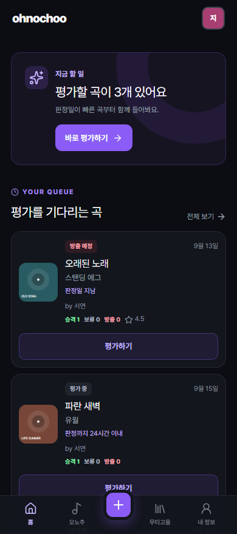
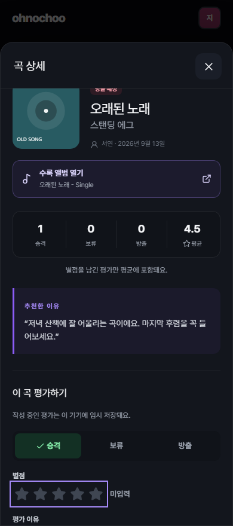
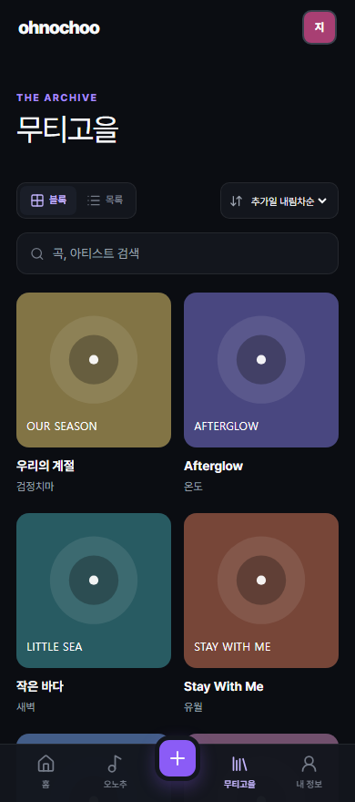

<p align="center">
  
</p>

<h1 align="center">ohnochoo</h1>

<p align="center">
  <strong>오늘의 노래를 추천하고, 함께 들을 플레이리스트를 만들어요.</strong><br />
  친구들과 곡을 나누고 승격 · 보류 · 방출로 평가하는 모바일 중심 음악 웹앱
</p>

<p align="center">
  
  
  
  
</p>

<p align="center">
  <a href="#screens">화면 둘러보기</a> ·
  <a href="#quick-start">빠른 시작</a> ·
  <a href="docs/DEVELOPMENT.md">개발 가이드</a> ·
  <a href="docs/OPERATIONS.md">운영 가이드</a>
</p>

---

<a id="screens"></a>

## 화면 둘러보기

| 평가를 기다리는 곡 | 앨범을 듣고 평가하기 | 함께 모은 무티고을 |
|:---:|:---:|:---:|
|  |  |  |

실제 앱을 예시 데이터로 촬영한 화면입니다. 모바일에서는 하단 내비게이션, 넓은 화면에서는 사이드바를 사용합니다.

## 이렇게 사용해요

1. **내 프로필 선택** — 프로필 사진과 이 기기의 알림을 설정해요.
2. **오늘의 노래 추천** — Apple Music 플레이리스트에서 가져오거나 곡명·아티스트를 직접 입력해요. 추천 이유와 첫 승격 평가도 함께 저장해요.
3. **듣고, 평가하고, 대화하기** — 수록 앨범을 열어 듣고 승격·보류·방출과 별점, 이유를 남겨요. 친구의 평가에는 답글을 달 수 있어요.
4. **무티고을에 모으기** — 등록 후 7일이 지나 승격 조건을 만족한 곡은 관리자가 무티고을로 옮겨요.

## 주요 기능

| | 할 수 있는 일 |
|---|---|
| **추천과 평가** | 추천 이유, 0.5점 단위 별점, 평가 수정, 300자 이내 답글 |
| **오늘의 평가** | 판정일이 빠른 미평가 곡부터 보기, 남은 시간 표시, 바로 평가하기 |
| **Apple Music** | 플레이리스트 동기화, 커버 불러오기, 곡의 수록 앨범으로 이동 |
| **작성 중에도 안심** | 추천·평가·답글 초안 복원, 저장 실패 시 내용 유지, 수동 업데이트 |
| **함께 듣기** | 실시간 데이터 갱신, 새 곡·평가·답글 알림, 해당 내용으로 바로가기 |
| **내 기기에서** | 홈 화면에 웹앱 추가, 프로필 사진, 기기별 알림 설정·테스트 |
| **관리** | 관리자 로그인, 곡 정보 수정, 무티고을 이동, 방출 예정 곡 확인·삭제 |

앨범 정보는 플레이리스트의 곡명·아티스트와 대조해 가져옵니다. 조회에 실패하거나 일치하는 곡이 없으면 플레이리스트 링크와 재시도를 표시합니다.

## 판정 기준

**승격 표가 방출 표보다 3표 이상 많으면 승격 조건을 만족합니다.** 보류 표와 별점은 이 조건에 포함하지 않습니다.

| 상태 | 조건 |
|---|---|
| 평가 중 | 등록 후 7일 미만이며 승격 조건 미충족 |
| 승격 후보 | 등록 후 7일 미만이며 `승격 ≥ 방출 + 3` |
| 무티고을 이동 가능 | 등록 후 7일 경과 및 승격 조건 충족 |
| 방출 예정 | 등록 후 7일 경과 및 승격 조건 미충족 |

별점 `0`은 **미입력**으로 표시하고 평균에서 제외합니다. 상태 판정만으로 곡이 자동 이동하거나 삭제되지는 않습니다. 기준 구현은 [songRules.ts](src/lib/songRules.ts)를 참고하세요.

<a id="quick-start"></a>

## 빠른 시작

로컬 검증 환경은 **Node.js 24 / npm 11**입니다. 먼저 [Supabase 초기 설정과 환경 변수](docs/OPERATIONS.md#setup)를 준비해 주세요.

```bash
git clone https://github.com/shinjuyeop/ohnochoo.git
cd ohnochoo
npm ci
```

[.env.example](.env.example)을 `.env.local`로 복사하고 값을 입력합니다.

```powershell
# Windows PowerShell
Copy-Item .env.example .env.local
```

```bash
# macOS / Linux
cp .env.example .env.local
```

```bash
npm run dev
```

[localhost:5173](http://localhost:5173)에서 실행됩니다. 개발 서버가 `/api/*`도 함께 처리합니다. `npm run preview`는 정적 빌드만 제공하므로 API 확인에는 개발 서버를 사용하세요.

| 명령어 | 용도 |
|---|---|
| `npm run dev` | 로컬 앱과 API 실행 |
| `npm run build` | 타입 검사와 배포용 빌드 |
| `npm run test` | 핵심 규칙 단위 테스트 |
| `npm run test:api` | API·앨범 파서·알림 인증 테스트 |
| `npm run test:e2e` | 화면·초안·저장·알림 링크 브라우저 테스트 |

브라우저 테스트를 처음 실행한다면 `npx playwright install chromium`으로 Chromium을 설치합니다. 전체 명령어와 검증 범위는 [개발 가이드](docs/DEVELOPMENT.md#testing)에 정리했습니다.

## iPhone에서 사용하기

Safari에서 앱을 연 뒤 **공유 → 홈 화면에 추가**로 설치하고, 추가된 아이콘으로 실행하세요. 기기에 따라 **웹 앱으로 열기** 옵션을 켤 수 있습니다. [Apple 설치 안내](https://support.apple.com/guide/iphone/bookmark-a-website-iph42ab2f3a7/ios)

알림은 설치한 웹앱의 **내 정보**에서 켭니다. 홈 화면 웹앱의 Web Push는 iOS/iPadOS 16.4 이상에서 지원됩니다. [WebKit 안내](https://webkit.org/blog/13878/web-push-for-web-apps-on-ios-and-ipados/)

새 버전 안내가 나타나면 작성을 마친 뒤 **업데이트**를 누르세요. 초안은 프로필·곡별로 이 브라우저에 보관하며, 마지막 저장 시점에서 7일이 지나면 복원하지 않습니다. PWA 설치가 오프라인 사용을 보장하지는 않으며 데이터 조회와 저장에는 네트워크가 필요합니다.

## 더 알아보기

| 문서 | 담긴 내용 |
|---|---|
| [개발 가이드](docs/DEVELOPMENT.md) | 기술 구성, 폴더 구조, 데이터 흐름, API, 테스트, 화면 캡처 |
| [운영 가이드](docs/OPERATIONS.md) | 환경 변수, DB·관리자·Storage 설정, 배포, 알림 일정, 문제 해결 |
| [환경 변수 예시](.env.example) | 로컬·Vercel에 설정할 변수 목록 |
| [DB 스키마](supabase/schema.sql) · [마이그레이션](supabase/migrations) | 새 환경 구성과 기존 DB 변경 |

> 일반 프로필 선택은 본인 인증이 아닙니다. 링크를 공유하는 소규모 모임을 전제로 하며, 관리자 기능은 Supabase Auth와 DB 정책으로 별도 보호합니다. 자세한 범위는 [권한과 데이터 보관](docs/OPERATIONS.md#permissions)을 참고하세요.

## 라이선스

프로젝트의 `package.json` 라이선스 표기는 **ISC**입니다. 번들에 포함된 **Pretendard Variable 1.3.9**는 [SIL Open Font License](public/assets/fonts/OFL.txt)를 따릅니다.
